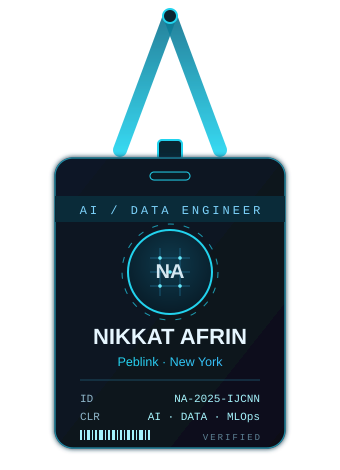
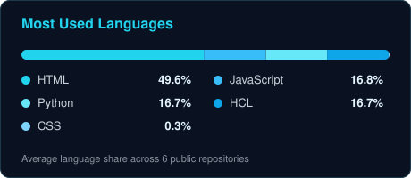
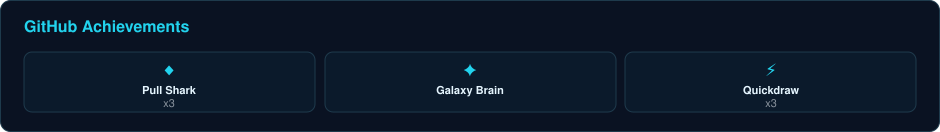

<!-- ============ HERO ============ -->

 

<!-- Animated typing tagline -->

 

  

### 🪐 &nbsp;[**nikkat-afrin.github.io**](https://nikkat-afrin.github.io/)

Live dashboards, the IEEE paper, and every project in one place.

 

<!-- ============ ID CARD + ABOUT ============ -->
<table border="0" align="center">
<tr>
<td width="36%" align="center" valign="middle">

</td>
<td width="64%" valign="top">

### `> whoami`

I build **cloud-native AI & data platforms** at **Peblink / World Literacy Research Center**, turning student audio and reading data into structured literacy insights with **speech AI, Python, FastAPI, and AWS**.

- 🔬 **Research:** First-author of **SigmaCam**, *Exact Decision Boundary Extraction for DNNs with Smooth Nonlinearities* (**IEEE IJCNN 2025**).
- 🤖 **I work across:** AI agents, RAG systems, voice AI, data engineering, applied ML, and intelligent workflow automation.
- 🌱 **Currently leveling up:** advanced GCP data engineering, production-grade agentic AI, and scalable MLOps.
- 💬 **Ask me about:** Python, FastAPI, AWS/Azure, RAG, LangChain, Whisper, voice AI, dashboards, and ML research.
- ⚡ **Fun fact:** I love sand painting and cooking, probably because I enjoy turning raw, messy pieces into something meaningful.

📍 New York · 🎓 Yeshiva University · she/her

</td>
</tr>
</table>

 

<!-- ============ FEATURED RESEARCH ============ -->

### 🧠 Featured Research

<table align="center">
<tr>
<td valign="top">

**[SigmaCam: Exact Decision Boundaries for Smooth DNNs](https://github.com/Nikkat-Afrin/SigmaCam)**
`PyTorch` · `Interpretability` · `IEEE IJCNN 2025`

A theoretically exact, recursive algorithm that extracts decision boundaries for MLPs with **smooth activations** (Sigmoid, SiLU), where prior exact methods (SplineCam) can't go. Ships with a pip-installable package, 8 Colab demos, and training-time boundary animations.

</td>
</tr>
</table>

 

<!-- ============ CERTIFICATIONS ============ -->

### 📜 Certifications

<table align="center">
<tr>
<td align="center" width="50%">

**Professional Data Engineer**

`Google Cloud` · `BigQuery` · `Dataflow` · `Pub/Sub`

Issued Aug 2026 · Expires Aug 2028

</td>
<td align="center" width="50%">

**Fabric Data Engineer Associate**

`Microsoft Fabric` · `Spark` · `Lakehouse` · `Dataflows Gen2`

Issued Aug 2026

</td>
</tr>
</table>

 

<!-- ============ TECH STACK ============ -->

### 🛠️ Tech Stack

 

<!-- ============ STATS ============ -->

### 📊 GitHub Analytics

  

  

  

 

<!-- ============ CONNECT ============ -->

### 🤝 Let's build something meaningful

I'm open to roles and collaboration in **AI/ML engineering, data platforms, and applied AI research.**

  

✨ <i>"Turning raw, messy pieces into something meaningful."</i> ✨

